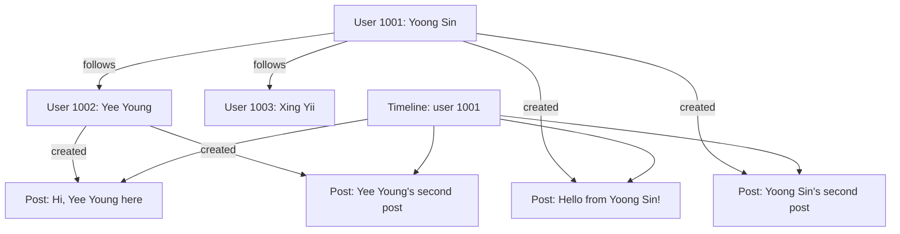

# 📱 Redis Social Media Backend

A lightweight social media backend built with **Flask** and **Redis**. This project allows users to:
- Create accounts
- Post messages
- Follow other users
- View a timeline of posts from people they follow

Powered by Redis for ultra-fast data storage and retrieval using optimized data structures (hashes, sets, lists).

---

   

---

## ⚡ Quick Start

```bash
# Clone the repo
git clone https://github.com/yourusername/redis-social-backend.git
cd redis-social-backend

# Set up virtual environment
python -m venv venv
venv\Scripts\activate  # or source venv/bin/activate for macOS/Linux

# Install dependencies
pip install -r requirements.txt

# Start Redis server in a separate terminal
redis-server

# Run the app
python app.py
```

---

## 🚀 Features

- User management (create, get)
- Posting messages
- Following users
- Aggregated timeline feed
- Redis-powered data model

---

## 🧠 Data Model (Redis Keys)

| Key Format              | Data Type | Description                          |
|------------------------|-----------|--------------------------------------|
| `user:<user_id>`       | Hash      | User profile                         |
| `user:<id>:posts`      | List      | List of post IDs                     |
| `post:<post_id>`       | Hash      | Post content and timestamp           |
| `user:<id>:following`  | Set       | IDs this user is following           |
| `user:<id>:followers`  | Set       | IDs of users following this user     |

---

## 📐 Architecture Diagram (Mermaid)



---

## 🧪 Example API Usage (with `curl`)

### Create Users
```bash
curl -X POST http://127.0.0.1:5000/user -H "Content-Type: application/json" -d "{\"user_id\": \"1001\", \"name\": \"Yoong Sin\", \"email\": \"yoong@example.com\"}"
```

### Create Posts
```bash
curl -X POST http://127.0.0.1:5000/post -H "Content-Type: application/json" -d "{\"user_id\": \"1003\", \"content\": \"Hello from Xing Yii!\"}"
```

### Follow User
```bash
curl -X POST http://127.0.0.1:5000/follow -H "Content-Type: application/json" -d "{\"follower_id\": \"1001\", \"followee_id\": \"1003\"}"
```

### View Timeline
```bash
curl http://127.0.0.1:5000/timeline/1001
```

---

## ⚙️ Setup & Run

### 1. Clone Repo & Setup Virtual Environment
```bash
git clone https://github.com/yourusername/redis-social-backend.git
cd redis-social-backend
python -m venv venv
venv\Scripts\activate  # Windows
source venv/bin/activate  # macOS/Linux
```

### 2. Install Requirements
```bash
pip install -r requirements.txt
```

### 3. Start Redis Server (if not running)
```bash
redis-server
```

### 4. Run Flask App
```bash
python app.py
```

---

## 📁 Project Structure
```
redis-social-backend/
│
├── app.py               # Main Flask app
├── redis_config.py      # Redis connection setup
├── requirements.txt     # Python dependencies
├── README.md            # Project documentation
└── (More endpoints in development...)
```

---

## 💡 Future Improvements
- Unfollow feature
- Likes and comments
- Timeline pagination
- Sorted set optimization for feed ranking
- Docker deployment

---

## 🧑‍💻 Author
- 👤 Teh Yoong Sin

Feel free to fork, improve, and share!

---

## 🛡️ License
MIT License
